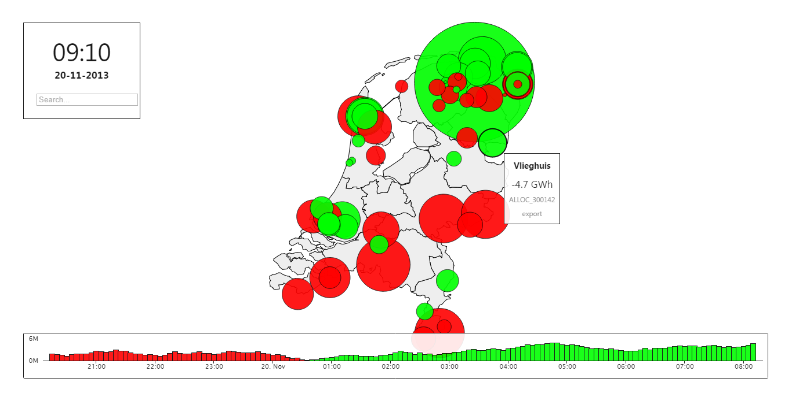

GeoDataMap
==========

*Interact with Timeseries Data on a Geographic Vector Map*

Features
--------

I've build this for demo purposes at work. We work with a lot of energy related data and this was my ideal way of visualizing and accessing real-time data coming into the system.

 1. Modular design using [Paper.js](http://paperjs.org) and [JQuery](http://jquery.com) and [Moment.js](http://momentjs.com)
 2. Easy to understand and customize
 3. Stand-alone for demo's and own projects!

Next to libraries i've used for this project, I also referenced some of the math from others that I use in my algorithms. Please see the code for full references.

How to Use
---------

Just clone the whole repository locally and open index.html!

*Try these things:*

 1. Zoom in and out using your mouse-wheel
 2. Click on any bubble with your mouse
 3. Press space to loop through time
 4. Hover the appearing barchart to relocate in time
 5. Search any timeseries using the searchbox
